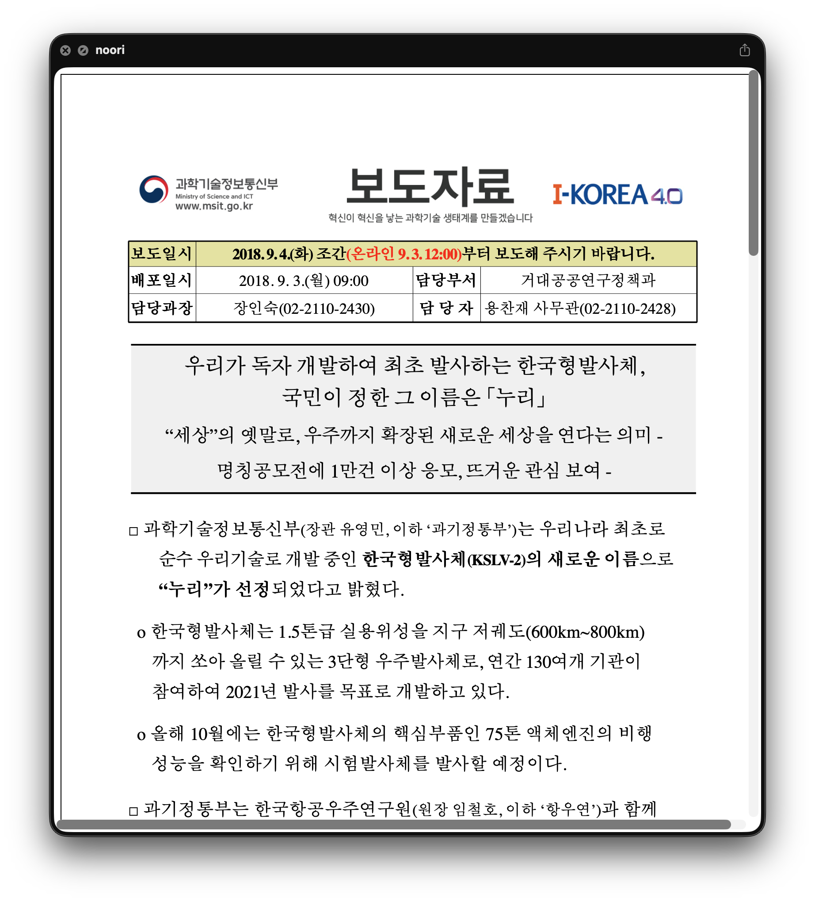

# HWPQuickLook

macOS Quick Look plugin for HWP (한글) documents. Press Space in Finder to preview `.hwp` and `.hwpx` files.



## How It Works

HWP files are parsed and rendered as HTML using the [hwp-core](https://github.com/ohah/hwpjs) Rust library via C FFI. The Quick Look extension receives the file data, calls `hwp_parse_to_html()`, and returns the resulting HTML to the system for display.

## Project Structure

```
HWPQuickLook/          # Host app (registers UTI types for .hwp/.hwpx)
HWPPreviewer/          # Quick Look preview extension (.appex)
HWPThumbnailer/        # Thumbnail extension (.appex)
Shared/BridgingHeader.h  # C FFI declarations
libs/                  # Pre-built static library (libhwp_ffi.a)
scripts/build-rust.sh  # Script to rebuild the static library
```

## Install

### Homebrew (recommended)

```bash
brew install hulryung/tap/hwpquicklook
```

### Manual

Download `HWPQuickLook.zip` from [Releases](https://github.com/hulryung/hwpql/releases), extract, and move `HWPQuickLook.app` to `/Applications`.

## Requirements

- macOS 12.0+

## Build from Source

Requires Xcode 15+.

```bash
xcodebuild -project HWPQuickLook.xcodeproj -scheme HWPQuickLook -configuration Release build
```

Pre-built `libhwp_ffi.a` is included in `libs/`. To rebuild it from source, see [Rebuilding the Rust library](#rebuilding-the-rust-library).

Copy the built app to `/Applications`:

```bash
cp -R ~/Library/Developer/Xcode/DerivedData/HWPQuickLook-*/Build/Products/Release/HWPQuickLook.app /Applications/
```

Then reset Quick Look caches:

```bash
qlmanage -r
qlmanage -r cache
```

## Testing

```bash
qlmanage -p ~/path/to/file.hwp
```

## Rebuilding the Rust library

Pre-built `libhwp_ffi.a`가 `libs/`에 포함되어 있으므로 일반적으로 이 과정은 필요하지 않습니다. hwp-core를 수정하거나 최신 버전으로 업데이트할 때만 필요합니다.

### Requirements

- [Rust toolchain](https://rustup.rs/)
- [hwpjs](https://github.com/ohah/hwpjs) 저장소

### Steps

```bash
# 1. hwpjs 저장소 클론 (이 프로젝트와 같은 디렉토리에)
git clone https://github.com/ohah/hwpjs.git ../hwpjs

# 2. 빌드 스크립트 실행
./scripts/build-rust.sh
```

또는 수동으로:

```bash
cd ../hwpjs
cargo build --release -p hwp-ffi
cp target/release/libhwp_ffi.a ../hwpql/libs/
```

## License

MIT
