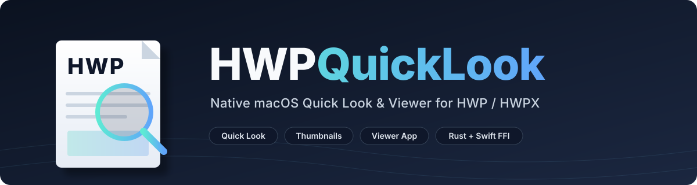

# HWPQuickLook



[English version](README.en.md)

macOS에서 한글(HWP) 문서를 네이티브로 미리보기 할 수 있는 **Quick Look 플러그인 + 독립 뷰어 앱**입니다. Finder에서 `.hwp` / `.hwpx` 파일을 선택하고 스페이스바를 누르면 바로 내용이 렌더링되며, 파일을 더블클릭하면 별도 창에서 열어볼 수도 있습니다. 한컴오피스 설치 없이 동작합니다.


## 주요 기능

- **Finder Quick Look 프리뷰** — 스페이스바로 `.hwp` / `.hwpx` 내용 즉시 렌더링 (SVG 기반 고품질)
- **Finder 썸네일** — 아이콘 크기에서 파일 미리보기 이미지 표시
- **독립 뷰어 앱** — 더블클릭으로 별도 창에서 HWP 파일 열기, Open Recent · Drag & Drop · Print 지원
- **한컴 네이티브 UTI 지원** — `LSHandlerRank=Owner`로 한컴오피스가 설치돼 있어도 우선 선점
- **Notarized Developer ID 서명** — Gatekeeper 경고 없이 설치·실행

## rhwp와의 관계

HWP/HWPX 파싱과 페이지 렌더링은 전적으로 [rhwp](https://github.com/edwardkim/rhwp) (Rust 크레이트)가 담당합니다. 이 저장소는 rhwp 위에 얹은 **macOS 네이티브 프런트엔드**입니다:

- `rhwp-ffi/` — rhwp를 C ABI로 노출하는 얇은 Rust 래퍼. rhwp는 특정 커밋에 pin 되어 있어 빌드 재현성이 보장됩니다.
- Swift 측은 `hwp_parse_to_html` / `hwp_get_preview_image` 두 함수만 호출해 SVG 기반 HTML과 임베디드 미리보기 이미지를 받아옵니다.
- Quick Look 프리뷰 / Finder 썸네일 / 독립 뷰어는 모두 동일한 FFI 결과를 사용합니다.

즉, HWP 파싱 품질·범위는 rhwp 버전이 결정하고, HWPQuickLook은 그 결과를 macOS의 Quick Look · Finder · 뷰어 창에 통합하는 역할을 맡습니다.

## 설치

### Homebrew (권장)

```bash
brew install --cask hulryung/tap/hwpquicklook
```

### DMG (최신 릴리스)

1. [Releases](https://github.com/hulryung/hwpql/releases) 페이지에서 `HWPQuickLook-vX.Y.Z.dmg` 다운로드
2. DMG를 열어 `HWPQuickLook.app`을 `Applications` 폴더로 드래그
3. Finder에서 `.hwp` 파일 선택 → 스페이스바

공증이 되어 있어 "확인되지 않은 개발자" 경고 없이 바로 실행됩니다.

## 시스템 요구사항

- macOS 12.0 (Monterey) 이상
- Apple Silicon 및 Intel 모두 지원

## 개발 / 빌드

직접 빌드, 릴리스 파이프라인 (서명·공증·DMG), rhwp 버전 업데이트, 프로젝트 구조, 문제 해결 등은 [DEVELOPMENT.md](DEVELOPMENT.md)를 참고하세요.

## 라이선스

MIT
