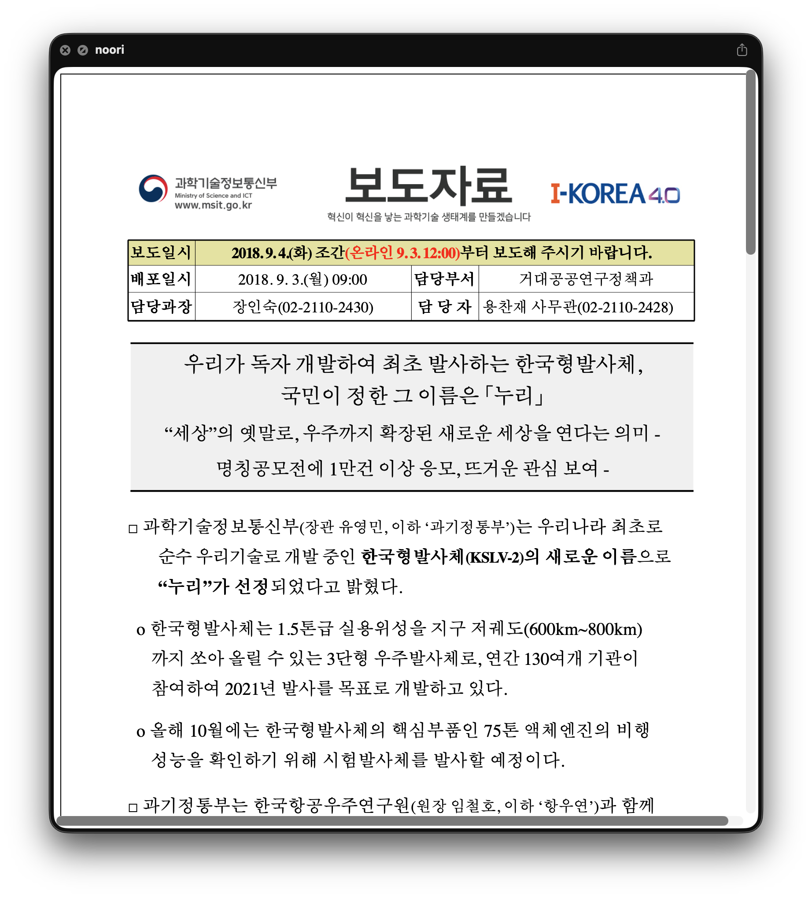

# HWPQuickLook

[English version](README.en.md)

macOS에서 한글(HWP) 문서를 네이티브로 미리보기 할 수 있는 **Quick Look 플러그인 + 독립 뷰어 앱**입니다. Finder에서 `.hwp` / `.hwpx` 파일을 선택하고 스페이스바를 누르면 바로 내용이 렌더링되며, 파일을 더블클릭하면 별도 창에서 열어볼 수도 있습니다. 한컴오피스 설치 없이 동작합니다.



## 주요 기능

- **Finder Quick Look 프리뷰** — 스페이스바로 `.hwp` / `.hwpx` 내용 즉시 렌더링 (SVG 기반 고품질)
- **Finder 썸네일** — 아이콘 크기에서 파일 미리보기 이미지 표시 (HWP 임베디드 프리뷰 이미지 사용)
- **독립 뷰어 앱** — 더블클릭으로 HWP 파일을 별도 창에서 열어 WebView로 감상
- **한컴 네이티브 UTI 지원** — `com.haansoft.hancomofficeviewer.mac.hwp/hwpx` 사용, `LSHandlerRank=Owner`로 우선 선점
- **Notarized Developer ID 서명** — Gatekeeper 경고 없이 설치·실행

## 동작 방식

HWP/HWPX 파일은 Rust로 작성된 [rhwp](https://github.com/edwardkim/rhwp) 크레이트에서 파싱됩니다. Swift 측은 C FFI를 통해 다음 함수들을 호출합니다:

- `hwp_parse_to_html(data)` → 페이지를 SVG로 렌더링해 HTML로 감싼 문자열 반환 (프리뷰 + 독립 뷰어)
- `hwp_get_preview_image(data)` → HWP 내부에 저장된 미리보기 이미지 추출 (Finder 썸네일)

프리뷰 익스텐션(`HWPPreviewer.appex`)은 HTML을 `QLPreviewReply`로 반환해 시스템 Quick Look 패널에 표시되고, 썸네일 익스텐션(`HWPThumbnailer.appex`)은 이미지를 `QLThumbnailReply`로 반환합니다. 독립 뷰어(`HWPQuickLook.app`)는 파일 오픈 이벤트를 받아 `WKWebView`에 HTML을 로드합니다.

> **참고 (v0.3.0~)**: 파싱 엔진이 `hwpjs` → `rhwp`로 전환되었습니다. FFI 시그니처는 호환되며 사용자 입장에서 달라지는 점은 없습니다. 또한 독립 뷰어 앱이 SwiftUI + AppKit 하이브리드 구조로 재작성되어 파일 라우팅 안정성이 개선되었습니다.

## 설치

### Homebrew (권장)

```bash
brew install hulryung/tap/hwpquicklook
```

(tap에 새 버전이 반영되기까지 며칠 시차가 있을 수 있습니다. 최신을 원하시면 아래 DMG 방식을 사용하세요.)

### DMG (최신 릴리스)

1. [Releases](https://github.com/hulryung/hwpql/releases) 페이지에서 `HWPQuickLook-vX.Y.Z.dmg` 다운로드
2. DMG를 열어 `HWPQuickLook.app`을 `Applications` 폴더로 드래그
3. Finder에서 `.hwp` 파일 선택 → 스페이스바 → 프리뷰 확인

공증이 되어 있어 "확인되지 않은 개발자" 경고 없이 바로 실행됩니다.

## 시스템 요구사항

- macOS 12.0 (Monterey) 이상
- Apple Silicon 및 Intel 모두 지원

## 직접 빌드하기

Xcode 15 이상이 필요합니다.

```bash
xcodebuild -project HWPQuickLook.xcodeproj -scheme HWPQuickLook -configuration Release build
```

빌드 결과를 시스템에 반영하려면 `/Applications`에 복사 후 Quick Look 캐시를 리셋합니다.

```bash
cp -R ~/Library/Developer/Xcode/DerivedData/HWPQuickLook-*/Build/Products/Release/HWPQuickLook.app /Applications/
qlmanage -r && qlmanage -r cache
```

미리 빌드된 `libhwp_ffi.a`가 `libs/`에 포함되어 있어, 일반적인 경우 Rust 라이브러리를 다시 빌드할 필요는 없습니다.

## 릴리스 빌드 (서명·공증·DMG)

전체 릴리스 파이프라인이 `scripts/release.sh`로 자동화되어 있습니다.

```bash
bash scripts/release.sh
```

수행 단계:
1. Xcode Release 빌드
2. `.app` 공증 제출 → Accepted → staple
3. `hdiutil`로 DMG 생성 (`/Applications` 심볼릭링크 포함)
4. DMG Developer ID 서명 (secure timestamp)
5. DMG 공증 → staple → `spctl` 검증

산출물: `build/HWPQuickLook-vX.Y.Z.dmg`

### 최초 1회 셋업

`notarytool` 키체인 프로필을 미리 저장해 두어야 합니다.

```bash
xcrun notarytool store-credentials "HWPQuickLook" \
  --apple-id <your-apple-id> \
  --team-id <your-team-id> \
  --password <app-specific-password>
```

`NOTARY_PROFILE` 환경변수로 다른 프로필 이름을 지정할 수 있습니다 (기본값: `HWPQuickLook`).

## Rust 라이브러리 재빌드

FFI 래퍼(`rhwp-ffi/` 크레이트)가 이 저장소에 포함되어 있고, rhwp는 `rhwp-ffi/Cargo.toml`에서 **특정 커밋을 git dependency로 고정**합니다. rhwp 버전 업그레이드나 FFI 인터페이스 변경 시에만 재빌드가 필요합니다.

### 요구사항

- [Rust toolchain](https://rustup.rs/)

### rhwp 버전 업데이트 절차

1. `rhwp-ffi/Cargo.toml`의 `rev = "..."` 값을 원하는 새 커밋 SHA로 변경
2. `./scripts/build-rust.sh` 실행

스크립트가 자동으로:
- `rhwp-ffi` 크레이트를 `cargo build --release` (cargo가 rhwp를 pinned rev로 fetch)
- 산출물을 `libs/libhwp_ffi.a`로 복사
- `libs/rhwp.lock`에 repo/commit/built_at/sha256/size 기록

### 산출물 검증

`scripts/release.sh`는 빌드 시작 전 `libs/libhwp_ffi.a`의 sha256이 `libs/rhwp.lock` 기록과 일치하는지 확인합니다. 불일치면 `scripts/build-rust.sh`를 다시 실행하라는 메시지와 함께 중단됩니다. 이는 누군가 `.a`만 교체하고 rhwp.lock을 업데이트하지 않은 상태를 원천 차단하기 위함입니다.

## 프로젝트 구조

```
HWPQuickLook/              # 독립 뷰어 앱 (SwiftUI + AppKit, UTI 등록 호스트)
├── Assets.xcassets/       # AppIcon 등 리소스
├── AppDelegate.swift      # SwiftUI App + NSApplicationDelegate
└── Info.plist             # UTI 선언 및 Document Types

HWPPreviewer/              # Quick Look 프리뷰 익스텐션 (.appex)
├── PreviewProvider.swift  # QLPreviewProvider 구현
└── Info.plist             # QLSupportedContentTypes

HWPThumbnailer/            # Finder 썸네일 익스텐션 (.appex)
├── ThumbnailProvider.swift
└── Info.plist

Shared/BridgingHeader.h    # Rust FFI 선언 (hwp_parse_to_html 등)

rhwp-ffi/                  # Rust FFI 래퍼 크레이트
├── src/lib.rs             # hwp_parse_to_html / hwp_get_preview_image 구현
└── Cargo.toml             # rhwp를 git rev로 pinning

libs/
├── libhwp_ffi.a           # rhwp-ffi 정적 라이브러리 (pre-built)
└── rhwp.lock              # 빌드 메타데이터 (commit SHA, sha256, size)

scripts/
├── build-rust.sh          # rhwp-ffi 빌드 + rhwp.lock 갱신
├── make-icon.swift        # 앱 아이콘 프로그래매틱 생성 (CoreGraphics)
└── release.sh             # 릴리스 파이프라인 (해시 검증 + 서명·공증·DMG)
```

## 테스트 & 문제 해결

### 프리뷰·썸네일 수동 검증

```bash
# Quick Look 프리뷰
qlmanage -p ~/path/to/file.hwp

# 썸네일 (모던 QLThumbnailProvider 강제 호출에는 -x 필요)
qlmanage -t -x -s 512 -o /tmp ~/path/to/file.hwp
```

Finder에서는 `-x` 없이도 자동으로 익스텐션이 호출됩니다.

### 설치 후 Finder에서 변경이 안 보일 때

Launch Services / Quick Look 캐시를 재구축하고 Finder를 재시작합니다.

```bash
/System/Library/Frameworks/CoreServices.framework/Frameworks/LaunchServices.framework/Support/lsregister \
  -kill -r -domain local -domain system -domain user
qlmanage -r && qlmanage -r cache
killall Finder
```

### 한컴오피스와 UTI 충돌

한컴오피스가 설치되어 있다면 동일 UTI를 소유하려고 경쟁할 수 있습니다. HWPQuickLook은 `LSHandlerRank=Owner`로 선점하지만, 한컴오피스를 제거했는데도 효과가 없으면 휴지통을 비우고 `lsregister`를 재구축하세요.

## 라이선스

MIT
